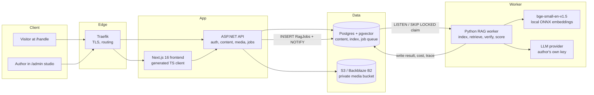
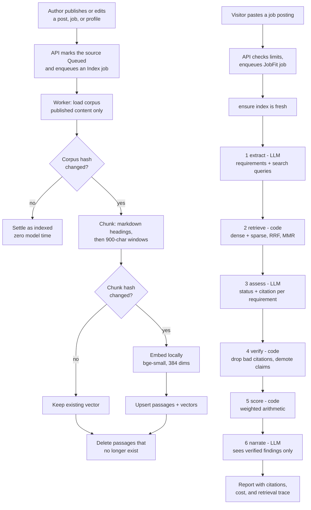
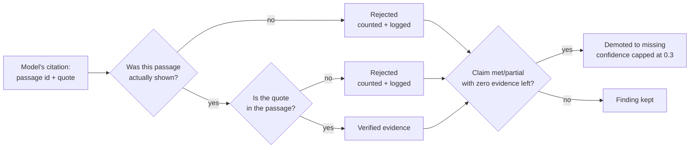
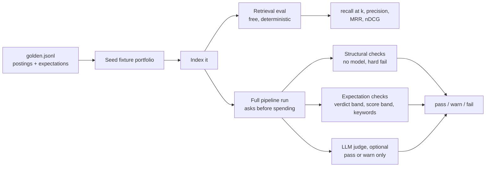

<p align="center">
  
</p>

<h1 align="center">PortfolioRAG</h1>

<p align="center">
  <strong>A portfolio that can prove it.</strong><br />
  Multi-author portfolios with a job-fit engine that cites every claim or doesn't make it.
</p>

<p align="center">
  
  
  
  
  
</p>

---

Every author gets a public portfolio at `/<handle>` and a studio to run it. A recruiter can paste a job
posting into that portfolio and get back which requirements the author's **published** work actually
evidences, with the passage behind every claim.

Most "AI resume matchers" produce confident prose about experience nobody has. This one is built the
other way round: **the model proposes, the code disposes.** Every judgement an LLM makes is checked or
replaced by something deterministic before a reader sees it:

- A citation to a passage the model was never shown is **dropped**.
- A quote that isn't really in the passage it cites is **dropped**.
- A claim left with no surviving evidence is **demoted to "not shown"**. It isn't quietly kept.
- The score is **arithmetic, not a model's opinion**, so two runs on the same evidence give the same number.

---

## Contents

- [Architecture](#architecture)
- [The flow, end to end](#the-flow-end-to-end)
  - [1. Adding content](#1-adding-content)
  - [2. Indexing and embedding](#2-indexing-and-embedding)
  - [3. Job-fit analysis](#3-job-fit-analysis)
  - [4. Checking: why the output can be trusted](#4-checking-why-the-output-can-be-trusted)
- [Evaluation](#evaluation)
- [Guardrails around cost and access](#guardrails-around-cost-and-access)
- [Running it](#running-it)
- [Repository layout](#repository-layout)

---

## Architecture



| Piece | What it does | Why it's built this way |
|---|---|---|
| **Frontend** (`frontend/`) | Public portfolios and the author studio. | API clients are **generated from the OpenAPI spec**, so the frontend can't drift from the backend's contract. |
| **API** (`backend/`) | Auth (email + Google, JWT and scoped API tokens), content, media, analytics, job orchestration. | It never runs a model. It writes a job row and returns immediately, and the browser polls for the result. |
| **RAG worker** (`rag/`) | Drains the job queue: indexing, retrieval, job-fit, cover letters. | It exposes **no port**. Nothing talks to it; it only reads and writes the database. Scale it with `--scale rag=N`. |
| **Postgres + pgvector** | Content, vector index (HNSW), keyword index (GIN `tsvector`), **and the job queue**. | One database instead of a database plus a broker. The job, its result, its cost and its audit trail live in the same row, next to the data they were computed from. |
| **Object storage** | Post media and avatars in a **private** bucket, served via expiring links. | MinIO locally (private and versioned, like B2) so the delete-every-version path is exercised before production. |

### The queue is a table

Workers claim jobs with `SELECT … FOR UPDATE SKIP LOCKED` and are woken with `LISTEN/NOTIFY`. That
gives you at-least-once delivery and no thundering herd without running a second piece of infrastructure.
`NOTIFY` only speeds things up. If a notification is lost, the job still runs, just a little later.

---

## The flow, end to end



### 1. Adding content

Authors write in the studio: Markdown posts, an experience timeline, a profile. Every save that could
change what the portfolio says calls `RagIndexScheduler`, which marks that source **Queued** in the
studio's index table and enqueues an `Index` job. The author can see, per post, whether it's queued,
indexing, indexed, or failed and why.

Only **published** material enters the corpus (`rag/src/rag/corpus.py`). A draft can never be cited to a
recruiter. Uploaded media is checked by **file signature**, not by extension or the client's
`Content-Type`, so a renamed executable doesn't become an "image".

### 2. Indexing and embedding

**Chunking** (`rag/src/rag/chunking.py`) is deterministic. The document is split on Markdown headings first,
so passages follow the author's structure, then into ~900-character windows with 150 characters of
overlap. Fragments under 120 characters are merged into the previous passage instead of becoming
passages that mean nothing on their own. Each passage is prefixed with its breadcrumb
(`[Vector Core > Replication]`), so a passage retrieved alone still says where it came from.

**Embedding** runs locally: `BAAI/bge-small-en-v1.5` via fastembed's ONNX runtime. That means 384
dimensions, no API key, no per-call cost, and no torch in the image. Because embedding is free, the index
can be rebuilt as often as it needs to be.

**Freshness is checked, not remembered.** Every analysis calls `indexing.ensure` first:

- A SHA-256 **corpus hash** over every source. If it's unchanged, the run costs two queries and no model time.
- A SHA-256 **content hash** per passage. Only passages whose text changed, or whose vector is missing, are re-embedded.
- Passages whose source was deleted are removed.

Nothing in the API has to remember to invalidate a cache, so the index can't go stale.

Failures stay with the source that caused them. One post that fails to embed is marked failed with its
reason, the rest still land, and the failed post **keeps yesterday's passages**, so today's bad edit
doesn't make it disappear from retrieval. The corpus hash is only written when every source succeeded,
so the next run retries the failures instead of skipping them.

The embedding width is checked at startup. If `RAG_EMBEDDING_DIMENSIONS` disagrees with the
`vector(384)` column, the worker refuses to start instead of writing vectors the column would reject.

### 3. Job-fit analysis

Six stages. Three use a model and three are plain code, and that split is the core of the design.

| # | Stage | Runs on | What it does |
|---|---|---|---|
| 1 | **Extract** | LLM | Turns the posting into discrete requirements, each marked essential or nice-to-have, **each with its own search query**. |
| 2 | **Retrieve** | Code | Dense (cosine over HNSW) **and** sparse (`ts_rank_cd` over GIN) for every query, fused with **Reciprocal Rank Fusion** (k=60), then diversified with **MMR** (λ=0.65). |
| 3 | **Assess** | LLM | For each requirement: met / partial / missing, a confidence, and citations to passage ids with quotes. |
| 4 | **Verify** | Code | Checks every citation against the passages that were actually shown. See below. |
| 5 | **Score** | Code | Weighted share of evidenced requirements, 0 to 100. |
| 6 | **Narrate** | LLM | Writes the summary from **verified findings only**. It never sees the passages. |

What each design choice fixes:

- **Extract before retrieve.** Embedding a 2,000-word posting as one vector gives you a vector for the
  *average* of the posting, which retrieves the portfolio's most generically impressive passages.
  Searching per requirement is what lets the tenth requirement be found at all.
- **Dense *and* sparse.** Vector search matches "built a scheduler for batch workloads" to "distributed
  job orchestration" but misses "Kubernetes" mentioned once in passing. Keyword search does the
  opposite. Postings are full of both kinds of requirement.
- **RRF instead of score blending.** Cosine similarity and `ts_rank_cd` live on different scales. RRF
  ignores the scores and keeps only the ranks, so there's no conversion to re-tune when either side changes.
- **MMR.** Without it, the top of the fused list is the same project four times.
- **Narrate last, blind.** Because stage 6 only receives verified findings, the prose can't bring back a
  claim that failed verification.

The pipeline doesn't know where passages come from. It takes a `Retriever` with two methods. In
production that's the database; in `rag-local` it's an HTTP client holding an API token. Both run the
same stages and the same verifier.

### 4. Checking: why the output can be trusted

This is the stage that matters most. The worst failure isn't a wrong answer. It's a fluent claim about
experience the author doesn't have, published on the author's own site. `rag/src/rag/citations.py`
enforces three rules:



1. **The passage must exist and must have been shown.** A `document_id` outside the retrieved set is a
   fabricated citation and is dropped.
2. **The quote must actually appear in it.** Both sides are Unicode-normalized (NFKC), case-folded and
   whitespace-collapsed, then compared as an exact substring. If that fails, a quote of at least 4 words
   still passes only if **≥ 80% of its words** appear in the passage. That tolerates light paraphrase and
   rejects invention.
3. **No evidence, no claim.** A `met` or `partial` finding with no surviving citation is rewritten as
   `missing`, its confidence is capped at 0.3, and the rationale says the claim was withdrawn.

Every rejection is counted and returned with the report (`citations_rejected`, `passages_cited`,
`passages_considered`) along with a full retrieval trace, so a bad answer can be diagnosed later.

**Scoring is a formula** (`rag/src/rag/scoring.py`):

```
score   = round( Σ weight·value / Σ weight × 100 )
value   = met 1.0 · partial 0.5 · missing 0.0
weight  = essential 1.0 · nice-to-have 0.35

verdict = strong ≥ 85 · promising ≥ 65 · partial ≥ 40 · weak
          ...and never "strong" while any essential requirement is unmet
```

An LLM asked to rate a candidate out of 100 gives a number that drifts between runs, clusters in the
seventies, and doesn't move when a requirement is demoted. A formula always moves in the same direction.
That's the only way two runs can be compared, and the only way the eval can tell an improvement from noise.

---

## Evaluation

The eval harness lives in `rag/eval/` and runs against a **fixture portfolio** (`eval/datasets/portfolio.json`)
seeded into a scratch account and deleted afterwards. Results don't depend on anyone's dev database.
With `--container`, it runs in a throwaway `pgvector` container migrated with the API's own migrations.



### Retrieval is measured separately, and for free

When an answer is bad, "the model reasoned badly about good passages" and "the model reasoned well about
passages that didn't contain the answer" look the same from outside, and they need opposite fixes. So
retrieval gets its own numbers, with no provider key, no network, and no cost. **CI runs it on every
push.**

| Metric | What it tells you | Why it's here |
|---|---|---|
| **recall@k** | Share of the labelled relevant sources that were retrieved. | It caps everything downstream: the assessor can't cite what retrieval never found. Fix this first. |
| **precision@k** | Share of retrieved passages that are relevant. | Tracks how much noise the assessor has to read through. |
| **MRR** | 1 / rank of the first relevant passage. | Shows whether the best evidence is at the top. |
| **nDCG** (binary gain) | Ranking quality against the ideal order. | The only metric that notices a change that **reorders** results without adding or losing any, which is exactly what tuning RRF or MMR does. Gain is binary because the labels are binary; graded relevance would mean inventing judgements nobody made. |

Retrieval-only runs report numbers and don't pass or fail. No single threshold is right for every
corpus, and a suite that fails on an arbitrary number is a suite people learn to bypass. `--k 3` tightens
the cutoff to show where recall starts to break.

### Generation is graded deterministically first

**Structural checks** (`eval/judge.py`) need no model and **fail the suite** when they break, because each
one is a guarantee the pipeline claims to make:

- every requirement extracted came back with a finding,
- no `met` or `partial` finding without evidence,
- no evidence with an empty quote,
- the report is grounded: it cited at least one passage.

**Expectation checks** assert what should stay stable across reruns: the verdict falls in a band, the
score falls in a range, certain keywords come back met, and certain keywords come back **missing**.
They never assert on wording. Generated prose isn't deterministic, and an eval that checks exact
sentences fails on every rerun until people stop reading it.

**The LLM judge** (`--judge`) grades only what has no formula, each on a 1 to 5 scale:

- **calibration**: would a reader predict the score from the summary alone?
- **specificity**: does it name concrete projects, companies and durations?
- **gap honesty**: are unmet requirements stated plainly and early?
- **usefulness**: does it explain *why* the verdict is what it is?
- **unsupported claims**: every statement that goes beyond the findings, quoted. Hedges like "likely
  has" still count.

The judge grades **the prose against the verified findings**, never its own opinion of the candidate.
That keeps it testing what it's supposed to test instead of redoing the analysis and disagreeing. It can
only move a report between **pass and warn**. A judge that could fail a build on its own would turn every
off day of the judge model into a red CI run.

### The golden set

Five cases in `eval/datasets/golden.jsonl`, each chosen to catch a specific failure:

| Case | What it tests |
|---|---|
| `storage-staff-strong` | A posting squarely on target. The system has to find the match and say so. |
| `streaming-senior-strong` | A different slice of the same portfolio. Retrieval has to follow the query instead of always surfacing the strongest project. |
| `ml-platform-partial` | Real overlap on infrastructure, none on modelling. The middle of the score range has to get used. |
| `embedded-firmware-partial` | The oldest, thinnest part of the portfolio. Dated experience has to be found and dated honestly. |
| **`mobile-adversarial-weak`** | **The important one.** It asks for iOS/Swift/HealthKit work the portfolio doesn't contain, against a portfolio full of adjacent-sounding material: embedded C, Bluetooth, low-power devices. A system that reasons "a strong systems engineer probably also..." fails. Expected: `weak`, score ≤ 25, and `swift`, `ios`, `healthkit`, `app store` all reported missing. |

### Reproducibility

- Runs are **seeded** (`--seed`, recorded in `run.json`). Retrieval is SQL and arithmetic, and ONNX inference on CPU is deterministic.
- The seed is passed to OpenAI, Gemini and Groq as a sampling seed (which those vendors describe as
  "mostly repeatable"). Anthropic accepts no seed, so full runs against it will vary between runs, and
  the eval is designed with that in mind.
- `--container` gives stable passage ids across runs, so prompts are identical run to run.
- Swapping the embedding model is a single command that doesn't touch your dev database:

  ```sh
  RAG_EMBEDDING_MODEL=BAAI/bge-base-en-v1.5 RAG_EMBEDDING_DIMENSIONS=768 \
    uv run rag-eval --container --retrieval-only
  ```

### Unit tests cover the adversarial paths

A real model won't reliably fabricate a citation when you ask it to, so `tests/test_pipeline.py` runs the
whole pipeline against a **stubbed provider** that does: it cites passages that were never shown and
invents quotes. The unit suite also pins chunking, RRF, MMR, scoring, citation verification, and the
C#/Python encryption interop against a ciphertext checked in from the .NET side.

---

## Guardrails around cost and access

Job-fit runs on the **author's own** LLM key, so the platform treats the author's money as something to
protect:

- **Keys are validated before they're stored**, using each vendor's cheapest authenticated endpoint
  instead of a trial completion the author would pay for. They're then encrypted at rest; the API and
  worker share the key through an interop-tested envelope.
- **A per-visitor daily limit, a monthly run cap, and a monthly USD budget.** Every job records its token
  usage and cost whether or not it succeeds, and the budget is enforced against that record.
- **Job-fit is opt-in.** It only appears on a portfolio when the author has a working key and chose to
  expose it. The UI states what a run costs, how many runs are left, and what it reads *before* the
  visitor runs it.
- **API tokens can't touch provider keys.** Those endpoints are session-only, so a leaked `pfl_…` token
  can at most search an index of already-published work.
- **Providers are adapters.** Anthropic, OpenAI, Gemini and Groq sit behind a four-member `ChatProvider`
  protocol. The pipeline never imports a vendor SDK. See `rag/src/rag/providers/README.md`.

---

## Running it

**Prerequisites:** Docker, .NET 10 SDK, Node 22, [uv](https://docs.astral.sh/uv/).

```sh
# Infrastructure: Postgres + pgvector on :5433, MinIO on :9000 (console :9001)
docker compose up -d

# API on http://localhost:5009 (Swagger UI at /swagger)
dotnet ef database update --project backend/backend.csproj
dotnet run --project backend

# Frontend on http://localhost:3000
cd frontend && cp .env.example .env.local && npm ci && npm run dev

# RAG worker (its encryption key must match the API's Llm:EncryptionKey)
cd rag && cp .env.example .env && uv sync && uv run rag-worker
```

Regenerate the typed API client after changing a controller or DTO:

```sh
cd frontend && npm run generate-api
```

### Tests and evals

```sh
dotnet test                                   # API, against a real Postgres
cd rag && uv run pytest                       # unit: no DB, no network, no cost
cd rag && uv run pytest -m integration        # + migrated Postgres
cd rag && uv run rag-eval --retrieval-only    # free retrieval metrics
cd rag && uv run rag-eval --judge             # full pipeline + judge (asks before spending)
```

### Run the pipeline with no API key

`rag-local` runs the model stages in a chat site you're already signed in to (Gemini, Claude,
ChatGPT) and asks the deployed API only for retrieval. The job posting never reaches the server, and
nothing is billed. See [`rag/README.md`](rag/README.md#running-it-locally).

### Deploying

Merging to `main` runs CI, builds the images into GHCR, and deploys over SSH:
`pg_dump` → migrate → `up -d` → health check, with **automatic rollback** to the previous tag if
`/healthz` fails. Server provisioning is an Ansible playbook. Full runbook: [`deploy/README.md`](deploy/README.md).

---

## Repository layout

```
backend/         ASP.NET API: controllers, services, EF Core migrations
backend.Tests/   xUnit, against a real Postgres fixture
frontend/        Next.js 16 app: public portfolios + /admin studio
  lib/api/generated/   OpenAPI-generated TypeScript client (do not hand-edit)
rag/             Python worker
  src/rag/       corpus, chunking, embeddings, indexing, retrieval, citations, scoring, pipeline
  eval/          fixture portfolio, golden set, metrics, judge, reports
  tests/         unit + integration
deploy/          Ansible, deploy/backup scripts, production runbook
```

Deeper dives: [`rag/README.md`](rag/README.md) for the retrieval service,
[`rag/src/rag/providers/README.md`](rag/src/rag/providers/README.md) for adding an LLM vendor, and
[`deploy/README.md`](deploy/README.md) for operations.
