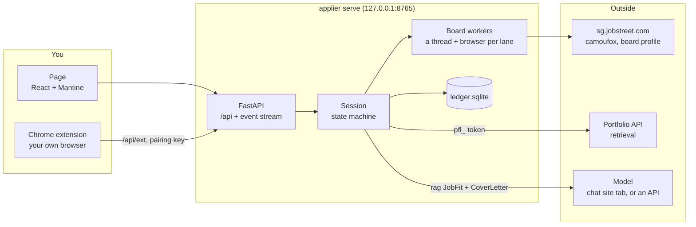
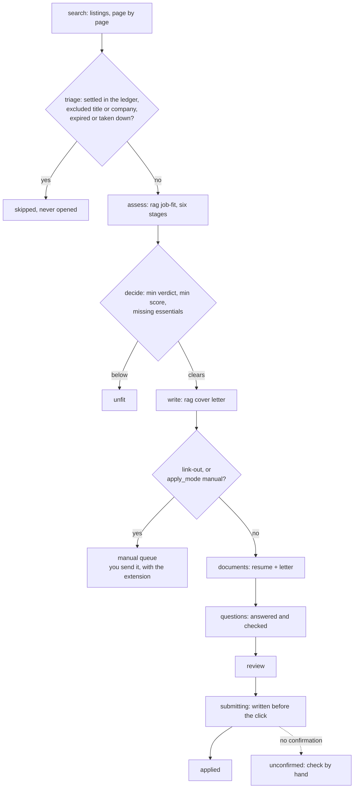
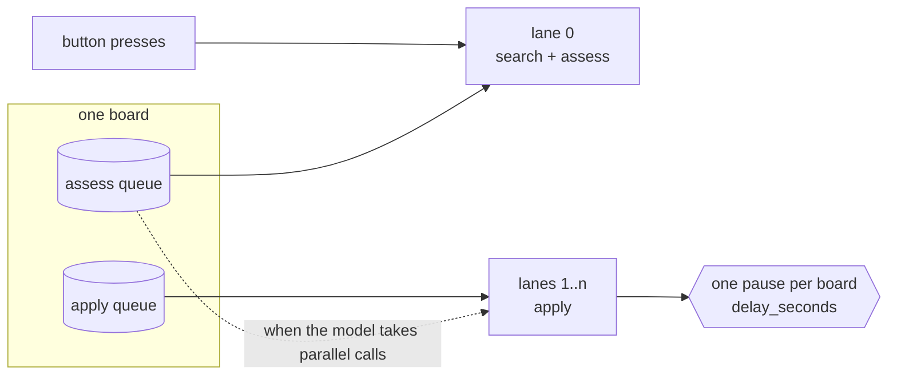
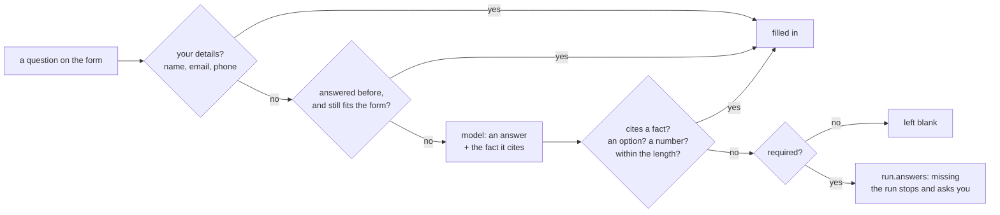
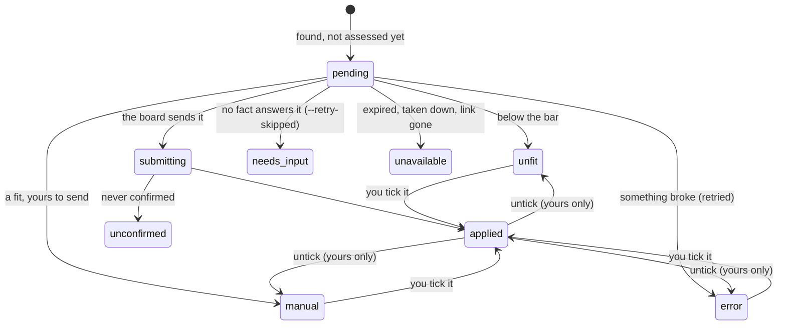
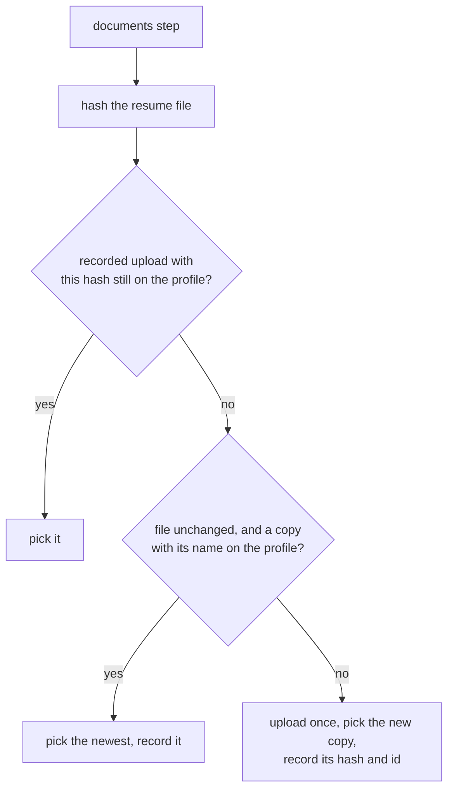

<p align="center">
  
</p>

<h1 align="center">Auto Applier</h1>

<p align="center">
  <strong>A job-hunting autopilot that will not make anything up.</strong><br />
  Finds postings, measures each against the portfolio, and applies to the ones that clear the bar.
</p>

<p align="center">
  
  
  
  
  
  
</p>

---

applier finds postings on job boards, measures each one against the portfolio with the `rag`
job-fit pipeline, and applies to the ones that clear the bar: a cover letter written from the same
portfolio, employer questions answered from facts you wrote down, submitted through the board's own
form. It runs on your machine, in browsers you are signed in to. Nothing is hosted.

The model reads postings, judges evidence and writes. **Everything that decides is code**, and
everything the model produces is checked before it can do anything:

- An answer to an employer question that does not **cite one of your facts** is discarded.
- An answer that is not **one of the form's options**, not a number where a number is asked, or
  over the field's length is discarded.
- A **required question left without an answer skips the posting**. Skipping costs nothing. A
  false answer to an employer does.
- The verdict is compared with **your thresholds in code**, and a submission is written to the
  ledger **before the click**, so nothing is ever sent twice.

---

## Contents

- [Architecture](#architecture)
- [The run, end to end](#the-run-end-to-end)
  - [Several at once](#several-at-once)
  - [Why a run ended](#why-a-run-ended)
- [Answering employer questions](#answering-employer-questions)
- [Keeping track: the ledger](#keeping-track-the-ledger)
  - [What you applied to yourself](#what-you-applied-to-yourself)
  - [One resume, uploaded once](#one-resume-uploaded-once)
- [Getting started](#getting-started)
  - [The setup run](#the-setup-run)
  - [The browser extension](#the-browser-extension)
  - [Credentials](#credentials)
- [The controller](#the-controller)
- [Using it from the command line](#using-it-from-the-command-line)
- [Safety](#safety)
- [Adding a board](#adding-a-board)
- [Tests](#tests)
- [Repository layout](#repository-layout)

---

## Architecture



| Piece | What it does | Why it's built this way |
|---|---|---|
| **Page** (`web/`) | Toggles, the table of every posting, reports, letters, the ledger, setup. | It holds no state of its own. Every toggle writes `applier.yaml`, so the page and `applier run` can never disagree. |
| **Controller** (`src/applier/controller/`) | The run as a state machine, with you able to press buttons mid-way. | Small commands on priority queues, so a button press is answered between two postings, not after forty. |
| **Board adapter** (`src/applier/boards/`) | `search`, `fetch`, `apply` on one board, in one tab. | It never sees the policy, the model, the ledger or the controller, so a new board is only its own selectors. |
| **Form reader** (`src/applier/js/fields.js`) | Every question under an element, whatever controls draw it. | One file, evaluated by Playwright **and** bundled into the extension. A bug fixed once is fixed in both. |
| **Ledger** (`.applier/ledger.sqlite`) | Every posting ever seen and what became of it. | Written after every posting. A settled posting is never opened again, so runs are safe to repeat. |
| **Extension** (`extension/`) | Fills forms in your own browser: link-outs, and anything you keep for yourself. | Your browser, your sign-ins, your send button. It asks the controller for answers and never decides. |

---

## The run, end to end



| Step | Runs on | What it does |
|---|---|---|
| **search** | board | Listings for each configured search, page by page. |
| **triage** | code | Skips what the ledger has settled, titles and companies the policy excludes, and postings that expired or were taken down. |
| **assess** | rag | The six-stage job-fit pipeline. Verdict and score are computed in code. A posting with no requirements to read is marked unavailable, since asking again would find nothing more. |
| **decide** | code | The policy's thresholds: `min_verdict`, `min_score`, `allow_missing_essentials`. |
| **write** | rag | The cover-letter pipeline, citing the same portfolio. |
| **route** | code | Quick apply with `apply_mode: auto` goes to the board. A link-out, or `apply_mode: manual`, goes to the manual queue. |
| **answer** | LLM | Employer questions: your details and remembered answers first, then `candidate.facts`. Checked in code. |
| **submit** | board | Documents, questions, profile, review, submit. |

A posting that links out to the employer's own site is **assessed like any other**. Whether it is
worth applying to does not depend on whose form it is. Only who fills the form does: the board
adapter never follows a link-out, so a fit goes to the manual queue.

### Several at once



Each board runs `run.workers` browsers (between 2 and 8). Lane 0 only ever searches and assesses,
so a form being filled, or a question waiting on you, never holds up the next assessment. The
others apply, and help assess when there is nothing to apply to. An API takes several calls at once;
a chat site opens one tab per lane in its one signed-in browser. `policy.delay_seconds` is booked
**per board**, not per lane, so more lanes never mean a faster pace at the board.

### Why a run ended

The page and the log say it in one line: how many were applied to and assessed, then whatever is
left (to send by hand, waiting to be picked, **not assessed** because `max_assessments` was
reached, or failed). A stop says what stopped it and how many postings it left unassessed; *Start*
picks those up again. A search that fails part-way does not stop the run unless nothing else would
get past it either (signed out, a bot check).

---

## Answering employer questions



Answers are tried cheapest first. Your remembered answers are also handed to the model as facts it
may cite, so "When can you start?" can be answered from what you once said about your notice
period, and the citation check still applies. Options are matched exactly, then ignoring case and
spacing, then by a **unique** prefix, and never by nearest neighbour: an answer that names no option
is a wrong answer, not a close one.

`run.answers` decides how often you are asked:

| Setting | What happens when nothing answers a required question |
|---|---|
| `never` | The posting is skipped and recorded as `needs_input`, with the questions that stopped it. |
| `missing` *(default)* | The run stops and asks, there and then, and **remembers what you answer**. |
| `always` | Every question and its answer, with the fact behind it, before the form is filled. |

---

## Keeping track: the ledger

Every posting this machine has looked at is a row in `.applier/ledger.sqlite`, with the report, the
letter and the answers it was decided on. A row with a settled status is never opened again.



| Status | Settled? | Means |
|---|---|---|
| `applied` | yes | Sent, by the applier or by you. |
| `manual` | yes | A fit with its letter written, waiting for you to send it. Nothing automatic ever submits it. |
| `submitting`, `unconfirmed` | yes | The submit was clicked and never confirmed. **Never retried**; check JobStreet's *My activity*. |
| `unfit`, `excluded`, `skipped` | yes | Below the bar, ruled out by the policy, or passed on. |
| `unavailable` | yes | Expired, taken down, already applied to, or nothing to measure. (`external` is the same idea from older versions, before link-outs were assessed.) |
| `pending` | no | A shortlist you never picked from. Offered again next time. |
| `needs_input` | until `--retry-skipped` | A required question no fact answers. `applier questions` lists them. |
| `error` | no | A step failed, with its page captured under `.applier/captures/`. Retried next run. |

### What you applied to yourself

Where you apply is yours to decide, so the tick in each row's first column (on the run's table and
in *History*) is not limited to what the run recommended:

- **Tick any row** that is not mid-application: unfit, skipped, failed, never assessed. It is
  recorded as `applied`, counts as applied, and is never touched by a run again.
- **Untick to take it back.** The ledger remembers the status it had before (`by_hand_from`) and
  puts it back. A posting that was not on record before is forgotten again.
- **One the applier sent stays ticked.** It went, whatever is ticked here.
- **Visited postings are highlighted.** Opening a posting from either table, or the drawer, colours
  its title, so the ones you have already looked at stand out. That is kept in this browser only; the
  tick is the record.

### One resume, uploaded once



Every upload adds another document to your JobStreet profile, so the file is uploaded **once per
change**, not once per application. `.applier/resumes/uploaded.json` keeps the file's SHA-256 and
the board's id for the copy that holds it. Edit the PDF and the next application uploads it once;
delete copies from your profile by hand and the newest one with the same name is picked instead.
Lanes take turns at this step, so two lanes cannot both upload the same edit.

---

## Getting started

```sh
cd applier
uv sync
uv run camoufox fetch                           # once, if rag has not already
(cd web && npm ci && npm run build)             # the page; it is built, not committed
uv run applier serve                            # then open http://127.0.0.1:8765
```

Ctrl+C stops it: whatever is in flight gets a few seconds to finish, the browsers close, and a
second Ctrl+C quits at once.

There is nothing to write and nothing to export first. `applier serve` writes a config if there is
none and opens on a setup run. Assessing does need the portfolio API, which it asks at
`https://api.blograg.pbh-dev.tech` unless *Settings → Model & access* points somewhere else.

### The setup run

Nobody can write down in advance every fact an employer will ask for, so this does not ask them to.

1. **Sign in to the board.** A window opens; you sign in once and the profile is kept.
2. **One mock application.** Paste a posting you are happy to have opened. Its form is walked as
   far as its questions and abandoned there: nothing answered, nothing sent, nothing recorded.
3. **Answer what it found.** That employer's own questions, plus the handful nearly every board
   asks. Each answer becomes a fact, named after what it states: *"Do you have a valid driving
   licence?"* is kept as `Valid driving licence`. The resumes on your board profile are read off
   the same form, so choosing one is picking from a list.
4. **Searches.** Keywords and a location, or a search URL you refined on the board. *Preview* shows
   the first page.

It needs no portfolio API, no rag worker and no model. It does not finish the job, and says so:
employers keep asking new questions, which is what `run.answers: missing` is for.

### The browser extension

For everything you apply to by hand, there is a Chrome extension (`extension/`). It reads a page's
questions with the same reader the board adapters use, asks `applier serve` for the answers, fills
them in the way typing would (framework-controlled inputs and searchable dropdowns included), and
attaches your resume. Whatever nothing answers is listed in its side panel; tick *Remember* and the
next form anywhere that asks the same question is answered with it.

```sh
cd extension
npm ci && npm run build        # then chrome://extensions → Developer mode → Load unpacked → dist/
```

Paste the controller's address and the pairing key from the page's *Browser extension* card into
the side panel. Then *Open* on a row in the manual queue: the page fills itself. A link-out opens
on the board's posting page; press its apply button and the employer's form, in the new tab, is
filled for the same posting. *I sent it* in the side panel records it.

### Credentials

| | Where it lives | Why |
|---|---|---|
| **Portfolio token** (`pfl_…`) | Pasted into the page; kept in `.applier/secrets.yaml`, created `0600` | Retrieval runs under it. Demanding it in the environment meant the controller could not start to show the box that asks for it. `APPLIER_PORTFOLIO_TOKEN` still works, and a pasted one wins. |
| **Provider key** (anthropic, openai, …) | The environment only | Worth real money if it leaks. The page names the variable and says whether it is set; the key never reaches the page, the config or the disk. |
| **Chat site sign-in** (`provider: web`) | A browser profile | *Settings → Model & access* opens a window to sign in, or `uv run --project ../rag python -m rag.webchat login gemini`. |

Neither credential ever goes into `applier.yaml`, which is the file you would show somebody to
explain how this is set up.

---

## The controller

```sh
uv run applier serve            # then open http://127.0.0.1:8765
```

The same run, with the decisions that matter handed back to you. The board's browser only does
unattended work (searching, reading postings, submitting quick-apply forms) in **one tab**. Close
that tab or the whole window and the next command reopens it on the same profile; the posting that
was cut off is tried once more. A bot check that does not clear by itself brings the window up for
you, then hides it again.

Three settings decide how much happens without you. All three live under `run:` in
`applier.yaml`, so the page's toggles and what `applier run` does tomorrow are the same thing.

| Setting | What turning it down means |
|---|---|
| **Pick postings itself** (`auto_pick`) | Off: everything that clears the policy waits in the table until you press *Apply*. |
| **Who sends an application** (`apply_mode`) | `auto`: JobStreet quick-apply forms are filled and submitted by the board. `manual`: every fit goes to the manual queue. `board_modes` sets it per board. Link-outs are always manual. |
| **When to ask about an answer** (`answers`) | `never`, `missing` *(default)* or `always`; see [Answering employer questions](#answering-employer-questions). |

The page also carries everything you need while deciding: the job-fit report and the letter behind
every row, the whole ledger with the digest of questions nothing answered, and a box to paste a
posting into for a report or a letter (`rag-local`'s two pipelines, mounted under `/api/rag`).

**Settings.** The resume is picked, not typed: *Choose a file* keeps a copy under
`.applier/resumes/` and sends that with every application and with the extension. Everything the
config holds is editable on the page, and the raw file view is checked against the same loader the
server started with, so nothing you type there can leave the tool unable to start. Saving goes
through a round-trip loader, so your comments survive.

**Building the page.** `web/dist` is not committed. Build it after cloning and after changing
anything under `web/src`; until then the server answers `/` with these instructions.

```sh
cd web
npm ci
npm run build        # web/dist, which applier serve serves
npm run dev          # or: http://127.0.0.1:5174 with hot reload, proxying /api to applier serve
```

---

## Using it from the command line

Everything here reads the same `applier.yaml` the page writes.

```sh
uv run applier run --dry-run --limit 2          # fill up to the review page, submit nothing
uv run applier run                              # the real thing, up to policy.max_applications
uv run applier apply https://sg.jobstreet.com/job/94734876 --dry-run
uv run applier status                           # what happened to everything seen
uv run applier questions                        # questions your facts could not answer
uv run applier run --retry-skipped              # after adding facts for them
```

Start with dry runs. A dry run captures the review page (screenshot and HTML under
`.applier/captures/`), so you can read exactly what would have been sent. `--capture-steps` saves
every step.

What counts as a fit, out of the box:

```yaml
policy:
  min_verdict: promising         # weak < partial < promising < strong
  min_score: 60
  allow_missing_essentials: 1
  max_applications: 10           # submitted per run
  max_assessments: 30            # assessed per run; each is several model calls
  delay_seconds: [20, 60]        # random pause between applications, per board
```

---

## Safety

- **Never twice.** A real submission is recorded as `submitting` *before* the click. If the process
  dies between the click and the next write, the posting stays `submitting` and is never retried.
  The same goes for a submit the board never confirms (`unconfirmed`), and for anything in the
  manual queue.
- **Errors carry two flags**, not message text: `fatal` (nothing later in the run will work either:
  signed out, a bot wall that does not clear, the portfolio API down) stops the run; `terminal`
  (this posting will never work) is never retried. One posting's request refused by the API is
  neither, so the run carries on.
- **The extension's routes want a key.** The server listens on loopback only, but any page in the
  same browser can reach 127.0.0.1, so `/api/ext/*` (which hands out your answers and your resume)
  wants the pairing key, compared in constant time, and sends no CORS headers.
- **Limits per run:** `max_applications` submitted and `max_assessments` assessed, with the
  `delay_seconds` pause kept across every lane of a board.

---

## Adding a board

A board is an adapter in `src/applier/boards/`, implementing `JobBoard` (`boards/base.py`), plus
one line in `BOARDS`. It gets an open browser and does five things: `search`, `fetch`, `apply`,
`ensure_signed_in` and `submitted`.

What a new board gets for free:

| | |
|---|---|
| **Reading forms** | `forms.read_fields(root)` reads every question under a locator (text, select, radio groups, checkboxes, single yes/no checkboxes) and tags each control; `forms.fill` writes an answer back through that tag. |
| **Answering** | `context.answerer.answer(handles, role=...)` returns checked answers, or raises `UnanswerableError`, recorded as `needs_input`. |
| **Failure capture** | `browser.fail(error)` saves the page, a screenshot and the console onto the error before raising. |
| **The controller, whole** | Picking, the table, the manual queue, the answer review and the setup run are all in terms of `JobBoard`. `ApplyContext.probe` stops at the first question step and reports what it found, which is the whole of the setup run. |
| **One tab** | An adapter never opens one; `browser.page` is all it reaches for. |

**JobStreet notes.** Search and posting pages are matched on SEEK's `data-automation` hooks.
Link-outs are read from the page's embedded server state, since camoufox evaluates scripts in an
isolated world and cannot see `window.SEEK_APOLLO_DATA`. The apply flow is matched by accessible
names and visible text, and the resume list by a radio group whose name now carries a React id
(`document-select-_r_8_`), so it is matched by prefix. Selectors live in
`boards/jobstreet/selectors.py`; when a step stops being recognised, the error says which one and
where its page was captured.

---

## Tests

```sh
uv run pytest                 # unit: config, answers, memory, ledger, pipeline, controller,
                              # setup, server, extension API, all with fakes
uv run pytest -m browser      # the form reader, filler and documents step in camoufox, and
                              # the extension end to end in Chromium (build it first)
uv run ruff check .
cd web && npm run lint        # the page's types
cd extension && npm test      # the extension's reader and filler, under jsdom
```

| Suite | What it pins down |
|---|---|
| `test_controller.py` | The bookkeeping a double application would come from: a manual-queue posting is on record as `manual` before anything else and never submitted by the board; a closed browser costs one retry of one posting; a submit the window closed on is **never** retried; a tick by hand is taken back to exactly where it was. |
| `test_jobstreet_documents.py` | The documents step on a page built from a real capture: the resume list matched by its React-suffixed name, an upload recorded and reused, an edited file uploaded once, a deleted copy falling back to its name. |
| `test_extension_e2e.py` | The built extension in real Chromium against a live controller: filling, *Remember*, the resume upload, a form that grows a second step, a link-out's employer form inheriting its posting. |
| `test_setup.py` | Arriving at a working profile without writing a config. One test exists because *"Do you have a driving licence?"* answered **No** was read back by YAML as `False`, and the config stopped loading. |

---

## Repository layout

```
applier/
  src/applier/
    boards/          JobBoard protocol + adapters (jobstreet/: board.py, selectors.py)
    controller/      session state machine, board workers and lanes, setup, answer review
    server/          FastAPI: the page's API, the extension's API, the built page
    js/fields.js     the form reader, shared with the extension
    answering.py     the model's answers, checked against facts, options and limits
    memory.py        remembered answers, matched by question
    ledger.py        SQLite: every posting and what became of it
    pipeline.py      the command-line run
  web/               the page: Vite + React + Mantine
  extension/         the Chrome extension (MV3): reader, filler, side panel
  tests/             unit with fakes; -m browser for camoufox and Chromium
  assets/logo.svg
.applier/            (gitignored) ledger, browser profiles, captures, resumes, secrets
```

Deeper dives: [`../rag/README.md`](../rag/README.md) for the job-fit and cover-letter pipelines,
and [`applier.example.yaml`](applier.example.yaml), which explains every setting.
